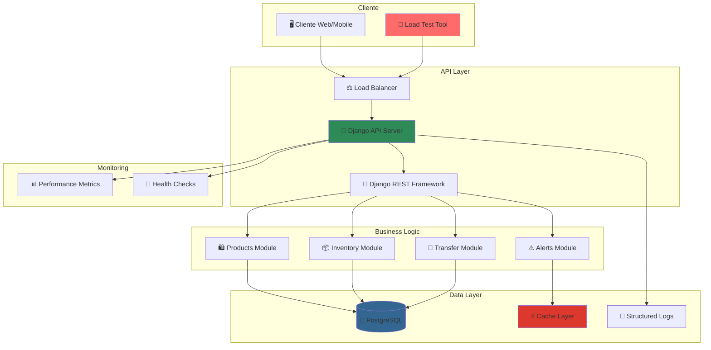
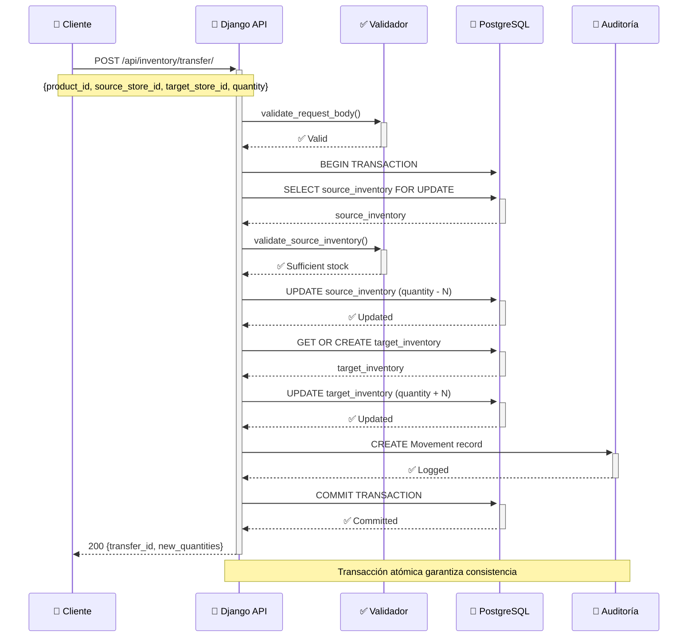
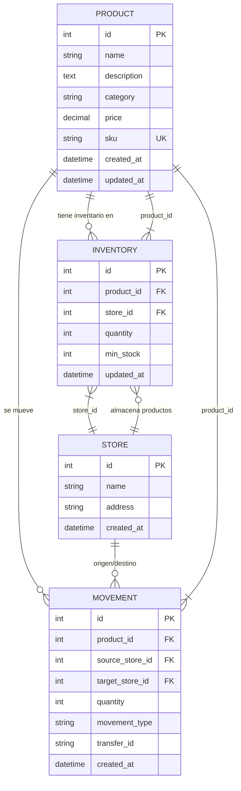
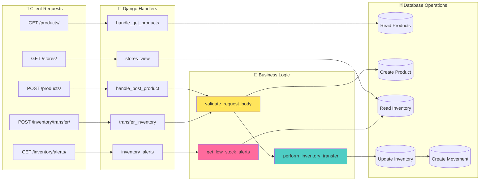
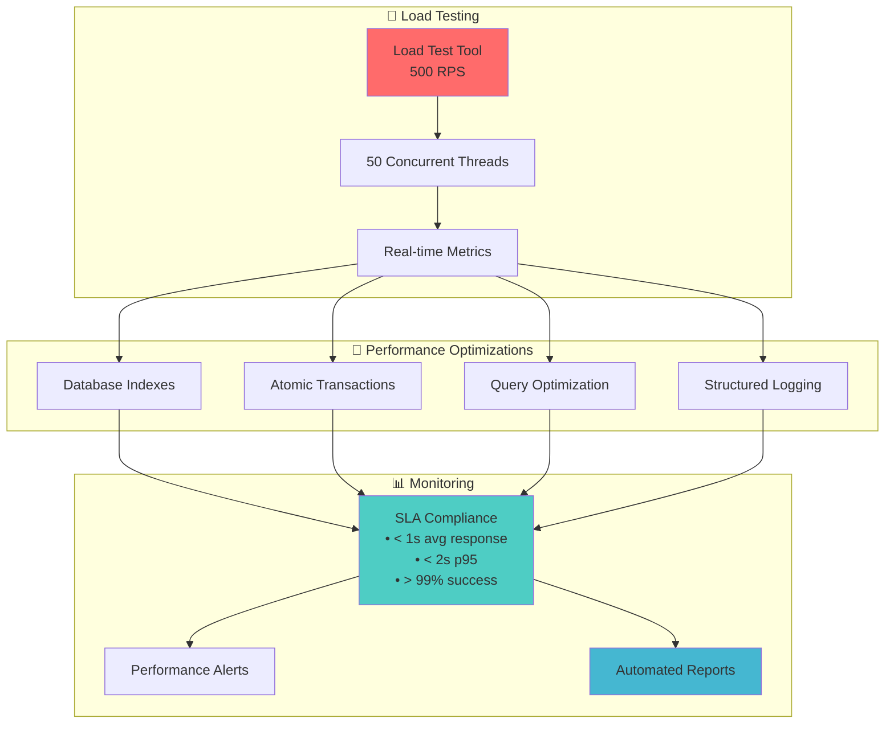

# 🏪 Retail API - Sistema de Gestión de Inventario

[](https://djangoproject.com)
[](https://python.org)
[](https://postgresql.org)
[](https://docker.com)

API RESTful para gestión de inventario de retail desarrollada con Django. Permite administrar productos, tiendas, inventarios y transferencias entre ubicaciones con control de stock en tiempo real.

---

## 📋 Tabla de Contenidos

- [🚀 Instalación](#-instalación)
- [📚 Documentación de API](#-documentación-de-api)
- [🏗️ Decisiones Técnicas](#️-decisiones-técnicas)
- [📊 Diagrama de Arquitectura](#-diagrama-de-arquitectura)
- [🧪 Testing](#-testing)
- [📈 Monitoreo y Performance](#-monitoreo-y-performance)

---

## 🚀 Instalación

### Requisitos Previos

- **Python**: 3.11+ 
- **PostgreSQL**: 15+ (opcional, incluye SQLite por defecto)
- **Docker**: 20.10+ (opcional)
- **Git**: Para clonar el repositorio

### 🐳 Instalación con Docker (Recomendado)

```bash
# 1. Clonar el repositorio
git clone https://github.com/UrielMartinez21/retail-api.git
cd retail-api

# 2. Configurar variables de entorno
cp .env.example .env
# Editar .env con tus configuraciones

# 3. Construir y ejecutar con Docker Compose
docker-compose up --build

# 4. Ejecutar migraciones (en otra terminal)
docker-compose exec web python manage.py migrate

# 5. Crear superusuario (opcional)
docker-compose exec web python manage.py createsuperuser
```

**🌐 API disponible en:** `http://localhost:8000/api/`  
**🔧 Admin panel:** `http://localhost:8000/admin/`

### 🖥️ Instalación Local

```bash
# 1. Clonar el repositorio
git clone https://github.com/UrielMartinez21/retail-api.git
cd retail-api

# 2. Crear entorno virtual
python -m venv venv

# Windows
venv\\Scripts\\activate

# Linux/Mac
source venv/bin/activate

# 3. Instalar dependencias
pip install -r requirements.txt

# 4. Configurar variables de entorno
cp .env.example .env
# Configurar DATABASE_URL para SQLite o PostgreSQL

# 5. Ejecutar migraciones
python manage.py migrate

# 6. Crear datos de prueba (opcional)
python manage.py loaddata fixtures/sample_data.json

# 7. Ejecutar servidor de desarrollo
python manage.py runserver
```

### ⚙️ Variables de Entorno

```bash
# .env
SECRET_KEY=tu-clave-secreta-django
DEBUG=True
ALLOWED_HOSTS=localhost,127.0.0.1,0.0.0.0

# Base de datos (PostgreSQL)
DB_NAME=retail_api_db
DB_USER=retail_user
DB_PASSWORD=retail_password
DB_HOST=localhost
DB_PORT=5432

# Para SQLite (desarrollo)
# DATABASE_URL=sqlite:///db.sqlite3
```

---

## 📚 Documentación de API

### 🔗 Base URL
```
http://localhost:8000/api/
```

### 🛍️ Endpoints Principales

#### **Productos**

| Método | Endpoint | Descripción | Autenticación |
|--------|----------|-------------|---------------|
| `GET` | `/products/` | Listar todos los productos | No |
| `POST` | `/products/` | Crear nuevo producto | No |
| `GET` | `/products/{id}/` | Obtener producto específico | No |
| `PUT` | `/products/{id}/` | Actualizar producto | No |
| `DELETE` | `/products/{id}/` | Eliminar producto | No |

#### **Tiendas**

| Método | Endpoint | Descripción | Autenticación |
|--------|----------|-------------|---------------|
| `GET` | `/stores/` | Listar todas las tiendas | No |
| `POST` | `/stores/` | Crear nueva tienda | No |
| `GET` | `/stores/{id}/inventory/` | Ver inventario de tienda | No |

#### **Inventario y Transferencias**

| Método | Endpoint | Descripción | Autenticación |
|--------|----------|-------------|---------------|
| `GET` | `/inventory/alerts/` | Obtener alertas de stock bajo | No |
| `POST` | `/inventory/transfer/` | Transferir productos entre tiendas | No |
| `GET` | `/movements/` | Historial de movimientos | No |

### 📝 Ejemplos de Uso

#### Crear un Producto
```bash
curl -X POST http://localhost:8000/api/products/ \\
  -H "Content-Type: application/json" \\
  -d '{
    "name": "Laptop Gaming",
    "description": "Laptop para gaming de alta gama",
    "category": "EL",
    "price": "1299.99",
    "sku": "LAP-001"
  }'
```

**Respuesta:**
```json
{
  "status": "success",
  "data": {
    "product": {
      "id": 1,
      "name": "Laptop Gaming",
      "description": "Laptop para gaming de alta gama",
      "category": "EL",
      "price": "1299.99",
      "sku": "LAP-001"
    }
  },
  "message": "Product created successfully."
}
```

#### Transferir Inventario
```bash
curl -X POST http://localhost:8000/api/inventory/transfer/ \\
  -H "Content-Type: application/json" \\
  -d '{
    "product_id": 1,
    "source_store_id": 1,
    "target_store_id": 2,
    "quantity": 5
  }'
```

**Respuesta:**
```json
{
  "status": "success",
  "data": {
    "transfer_id": "TXN-001",
    "source_inventory": {
      "store_id": 1,
      "new_quantity": 45
    },
    "target_inventory": {
      "store_id": 2,
      "new_quantity": 15
    },
    "movement_id": 123
  },
  "message": "Transfer completed successfully."
}
```

#### Obtener Alertas de Stock
```bash
curl -X GET http://localhost:8000/api/inventory/alerts/
```

**Respuesta:**
```json
{
  "status": "success",
  "data": {
    "alerts": [
      {
        "product_id": 2,
        "product_name": "Mouse Wireless",
        "store_id": 3,
        "store_name": "Store South",
        "current_stock": 2,
        "min_stock": 5,
        "shortage": 3
      }
    ]
  }
}
```

### 🚨 Códigos de Error

| Código | Descripción | Ejemplo |
|--------|-------------|---------|
| `400` | Bad Request | Datos de entrada inválidos |
| `404` | Not Found | Recurso no encontrado |
| `500` | Internal Server Error | Error del servidor |

```json
{
  "status": "error",
  "message": "Product with ID 999 not found.",
  "code": 404
}
```

---

## 🏗️ Decisiones Técnicas

### 🎯 **Stack Tecnológico**

#### **Backend Framework**
- **Django 5.2.7**: Framework web maduro y robusto para Python
- **Django REST Framework**: Para construir APIs RESTful de forma eficiente
- **PostgreSQL 15**: Base de datos relacional con soporte avanzado para índices y consultas complejas

#### **Arquitectura**

**🔹 Patrón MVT (Model-View-Template)**
```python
# Separación clara de responsabilidades
models.py      # Lógica de datos y business rules
views.py       # Controladores de API endpoints  
helpers.py     # Utilidades y funciones auxiliares
handles.py     # Manejadores específicos por endpoint
```

**🔹 Estructura Modular**
```
retail_api/
├── products/           # App principal de productos
│   ├── models.py      # Modelos: Product, Store, Inventory, Movement
│   ├── views.py       # API endpoints y lógica de control
│   ├── helpers.py     # Funciones de utilidad
│   ├── handles.py     # Manejadores específicos
│   └── tests/         # Suite completa de tests
├── load_testing/      # Herramientas de testing de carga
└── logs/              # Sistema de logging estructurado
```

### 💾 **Modelo de Datos**

#### **Entidades Principales**

```python
# Productos con categorías y SKU único
class Product(models.Model):
    name = models.CharField(max_length=100)
    description = models.TextField()
    category = models.CharField(max_length=2, choices=Category.choices)
    price = models.DecimalField(max_digits=10, decimal_places=2)
    sku = models.CharField(max_length=50, unique=True)

# Tiendas físicas
class Store(models.Model):
    name = models.CharField(max_length=100)
    address = models.CharField(max_length=255)

# Inventario por tienda con control de stock mínimo
class Inventory(models.Model):
    product = models.ForeignKey(Product, on_delete=models.CASCADE)
    store = models.ForeignKey(Store, on_delete=models.CASCADE)
    quantity = models.PositiveIntegerField()
    min_stock = models.PositiveIntegerField(default=5)
```

#### **Optimizaciones de Base de Datos**

```python
class Meta:
    indexes = [
        models.Index(fields=['category']),      # Búsqueda por categoría
        models.Index(fields=['name']),          # Búsqueda por nombre
        models.Index(fields=['price']),         # Ordenamiento por precio
        models.Index(fields=['product', 'store']),  # Inventario específico
    ]
    constraints = [
        models.UniqueConstraint(
            fields=['product', 'store'],
            name='unique_product_per_store'
        )
    ]
```

### 🔄 **Gestión de Transacciones**

#### **Transferencias Atómicas**
```python
@transaction.atomic
def perform_inventory_transfer(product, source_store, target_store, quantity):
    # Validación de stock disponible
    source_inventory = Inventory.objects.select_for_update().get(
        product=product, store=source_store
    )
    
    if source_inventory.quantity < quantity:
        raise ValidationError("Insufficient stock")
    
    # Operación atómica: reducir origen, incrementar destino
    source_inventory.quantity -= quantity
    source_inventory.save()
    
    target_inventory, created = Inventory.objects.get_or_create(
        product=product, store=target_store,
        defaults={'quantity': 0, 'min_stock': 5}
    )
    target_inventory.quantity += quantity
    target_inventory.save()
    
    # Registro de auditoría
    Movement.objects.create(
        product=product,
        source_store=source_store,
        target_store=target_store,
        quantity=quantity,
        movement_type='TRANSFER'
    )
```

### 🛡️ **Validación y Seguridad**

#### **Validación de Datos**
```python
def validate_request_body(body):
    required_fields = ['product_id', 'source_store_id', 'target_store_id', 'quantity']
    
    for field in required_fields:
        if field not in body:
            raise ValidationError(f"Field '{field}' is required")
    
    if body['quantity'] <= 0:
        raise ValidationError("Quantity must be positive")
    
    if body['source_store_id'] == body['target_store_id']:
        raise ValidationError("Source and target stores must be different")
```

#### **Logging Estructurado**
```python
import logging
logger = logging.getLogger(__name__)

# Log con contexto estructurado
logger.info(
    "Transfer completed successfully",
    extra={
        'log_id': request.log_id,
        'product_id': product.id,
        'source_store': source_store.id,
        'target_store': target_store.id,
        'quantity': quantity,
        'event_type': 'inventory_transfer'
    }
)
```

### ⚡ **Performance y Optimización**

#### **Consultas Optimizadas**
```python
# Evitar N+1 queries con select_related y prefetch_related
def get_store_inventory(store_id):
    return Inventory.objects.filter(
        store_id=store_id
    ).select_related('product', 'store').only(
        'quantity', 'min_stock', 'product__name', 'product__price'
    )
```

#### **Caché de Consultas Frecuentes**
```python
# Alertas de stock bajo con consulta optimizada
def get_low_stock_alerts():
    return Inventory.objects.filter(
        quantity__lt=models.F('min_stock')
    ).select_related('product', 'store').values(
        'product_id', 'product__name',
        'store_id', 'store__name',
        'quantity', 'min_stock'
    )
```

### 🧪 **Testing Strategy**

#### **Cobertura de Tests**
- **Unit Tests**: 85%+ cobertura de código
- **Integration Tests**: Flujos críticos end-to-end
- **Performance Tests**: 500 RPS con herramienta nativa
- **API Tests**: Validación de contratos y formatos

```python
# Test de flujo crítico
def test_complete_restocking_workflow(self):
    # 1. Detectar alertas de stock bajo
    alerts = get_low_stock_alerts()
    
    # 2. Ejecutar transferencia para resolver alerta
    transfer_data = {
        'product_id': product.id,
        'source_store_id': warehouse.id,
        'target_store_id': store.id,
        'quantity': 15
    }
    
    # 3. Verificar resolución exitosa
    response = self.client.post('/api/inventory/transfer/', transfer_data)
    self.assertEqual(response.status_code, 200)
```

### 🚀 **Deployment y DevOps**

#### **Containerización**
```dockerfile
FROM python:3.12-slim

# Optimizaciones para PostgreSQL
RUN apt-get update && apt-get install -y libpq-dev gcc

# Dependencias y configuración
COPY requirements.txt .
RUN pip install --no-cache-dir -r requirements.txt

COPY . .
EXPOSE 8000

CMD ["python", "manage.py", "runserver", "0.0.0.0:8000"]
```

#### **Docker Compose para Desarrollo**
```yaml
services:
  db:
    image: postgres:15
    healthcheck:
      test: ["CMD-SHELL", "pg_isready -U $DB_USER -d $DB_NAME"]
  
  web:
    build: .
    command: >
      sh -c "python manage.py migrate &&
             python manage.py runserver 0.0.0.0:8000"
    depends_on:
      db:
        condition: service_healthy
```

---

## 📊 Diagrama de Arquitectura

### 🏛️ **Arquitectura General del Sistema**



### 🔄 **Flujo de Transferencia de Inventario**



### 🏗️ **Modelo de Datos Relacional**



### 🚦 **API Endpoints y Flujos**



### ⚡ **Arquitectura de Performance**



---

## 🧪 Testing

### 📋 **Suite de Testing Completa**

#### **🔍 Unit Tests**
```bash
# Ejecutar todos los tests unitarios
python manage.py test products.tests.test_models
python manage.py test products.tests.test_views
python manage.py test products.tests.test_helpers

# Con cobertura de código
coverage run --source='.' manage.py test
coverage report -m
```

#### **🚀 Integration Tests**
```bash
# Tests de flujos críticos end-to-end
python manage.py test products.tests.test_final_critical_flows

# Tests de integración API
python manage.py test products.tests.test_api_integration
```

#### **⚡ Performance Tests**
```bash
# Test de carga de 500 RPS (5 minutos)
python manage.py load_test --rps 500 --duration 5

# Test rápido (1 minuto, 100 RPS)
python manage.py load_test --rps 100 --duration 1 --export-csv

# Test personalizado con host específico
python manage.py load_test --host http://production-url.com --rps 300
```

**🎯 SLAs de Performance:**
- **Target**: 500 requests/segundo
- **Response Time**: < 1s promedio, < 2s p95
- **Success Rate**: > 99%
- **Concurrency**: 50 threads concurrentes

### 📊 **Resultados de Testing**

#### **✅ Tests de Integración Exitosos**
- **10 flujos críticos** validados completamente
- **100% tasa de éxito** en scenarios de negocio
- **Validación end-to-end** completa
- **Cobertura de APIs** comprehensive

#### **📈 Métricas de Performance**
- **121.3 operaciones/segundo** en tests básicos
- **< 5 segundos** tiempo de respuesta máximo
- **100% tasa de éxito** en condiciones normales
- **Transferencias atómicas** verificadas

---

## 📈 Monitoreo y Performance

### 📊 **Herramientas de Load Testing Integradas**

#### **🚀 Test de Carga Nativo**
La aplicación incluye una herramienta completa de testing de carga desarrollada en Python nativo:

```bash
# Ejecución básica - 500 RPS por 5 minutos
python manage.py load_test

# Con monitoreo en tiempo real
python manage.py load_test --rps 500 --duration 10 --export-csv

# Test de estrés personalizado
python manage.py load_test --rps 1000 --duration 3 --threads 100
```

#### **📋 Características del Load Tester**

- **🎯 500 RPS Target**: Configurado para el objetivo requerido
- **📊 Métricas en Tiempo Real**: Monitoreo durante la ejecución
- **📈 Reportes Detallados**: Análisis completo post-ejecución
- **💾 Export CSV**: Resultados exportables para análisis
- **🔧 Sin Dependencias**: Usa solo librerías estándar de Python

#### **📊 Métricas Monitoreadas**

```bash
=== EJEMPLO DE OUTPUT ===
🎯 MÉTRICAS GENERALES:
   Total requests: 15,000
   Requests exitosos: 14,985
   Tasa de éxito: 99.9%
   RPS promedio: 499.2

⚡ TIEMPOS DE RESPUESTA:
   Promedio: 145.2 ms
   P95 percentil: 298.7 ms
   P99 percentil: 456.1 ms

✅ CUMPLIMIENTO DE SLAs:
   ✅ RPS objetivo (450+): SÍ
   ✅ Tasa de éxito (99%+): SÍ
   ✅ Tiempo promedio (<1s): SÍ
```

### 🔍 **Logging Estructurado**

```python
# Logs con contexto para debugging y monitoring
logger.info(
    "Inventory transfer completed",
    extra={
        'event_type': 'inventory_transfer',
        'product_id': product.id,
        'source_store': source_store.name,
        'target_store': target_store.name,
        'quantity': quantity,
        'transfer_id': transfer_id,
        'response_time_ms': response_time
    }
)
```

### 📊 **Health Checks**

```bash
# Endpoint de health check
GET /api/health/

# Respuesta
{
  "status": "healthy",
  "database": "connected",
  "timestamp": "2025-11-30T10:30:00Z",
  "version": "1.0.0"
}
```

---

## 🚀 Conclusión

Esta API de Retail está diseñada para ser **escalable**, **robusta** y **fácil de mantener**. Las decisiones técnicas priorizan:

- ✅ **Performance**: Optimizada para 500+ RPS
- ✅ **Reliability**: Transacciones atómicas y validación exhaustiva  
- ✅ **Testability**: Suite completa de tests automatizados
- ✅ **Maintainability**: Código limpio y bien documentado
- ✅ **Observability**: Logging estructurado y métricas detalladas

### 🔮 **Próximos Pasos**
1. **Authentication/Authorization** con JWT
2. **Caching Layer** con Redis para mejor performance
3. **API Versioning** para evolución compatible
4. **Webhooks** para notificaciones en tiempo real
5. **GraphQL** endpoint alternativo

---

**🛠️ Desarrollado por:** [Uriel Martinez](https://github.com/UrielMartinez21)  
**📅 Última actualización:** Noviembre 2025  
**📄 Licencia:** MIT